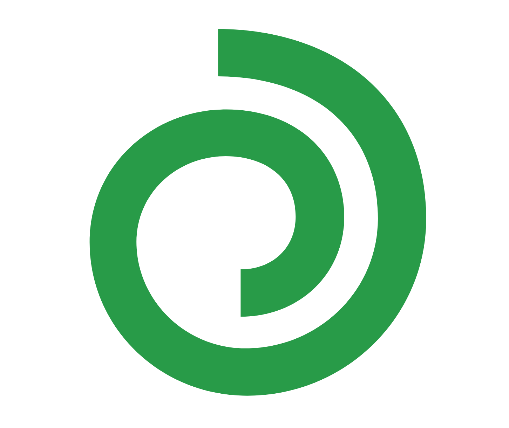
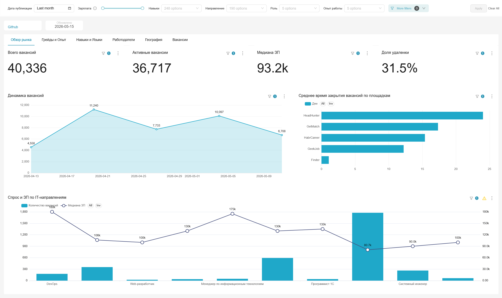

# itvacancies

Агрегатор IT-вакансий с автоматическим сбором, NLP-нормализацией и интерактивным дашбордом.

<p align="center">
  <a href="https://docs.docker.com/compose/"></a>
  <a href="LICENSE"></a>
  &nbsp;🌐 <strong>Live:</strong> <a href="https://itvacancies.tech">itvacancies.tech</a>
</p>

---

## Что это такое

**itvacancies** ежедневно собирает вакансии с шести IT-платформ:

<table>
<tr><td width="30"></td><td><a href="https://hh.ru"><b>hh.ru</b></a></td></tr>
<tr><td width="30"></td><td><a href="https://geekjob.ru"><b>GeekJob</b></a></td></tr>
<tr><td width="30"></td><td><a href="https://getmatch.ru"><b>GetMatch</b></a></td></tr>
<tr><td width="30"></td><td><a href="https://career.habr.com"><b>Habr Career</b></a></td></tr>
<tr><td width="30"></td><td><a href="https://finder.work"><b>Finder</b></a></td></tr>
<tr><td width="30"></td><td><a href="https://www.adzuna.com"><b>Adzuna</b></a></td></tr>
</table>

Данные со всех источников приводятся к единому виду через алгоритмы нечёткого поиска и языковую модель. Платформа предоставляет интерактивный дашборд для анализа IT-рынка труда: зарплаты, востребованные навыки, тренды по городам и грейдам.

---

## Скриншоты



---

## Быстрый старт

**Нужно:** Docker + Docker Compose, минимум **4–6 GB** свободной RAM.

```bash
# 1. Клонировать
git clone https://github.com/PiratikMr/itvacancies.git
cd itvacancies

# 2. Запустить
docker compose up -d
```

Первый запуск займёт 5–10 минут: загрузятся образы, инициализируются базы данных. Superset и NLP будут готовы раньше остальных.

> **Данные появятся на следующий день** — Airflow запускает сбор по расписанию. Чтобы запустить сбор вручную, откройте Airflow UI и активируйте нужный DAG.

---

## Основные сервисы

### Superset — аналитика

**http://localhost:16088** · логин: `admin` · пароль: `admin`

Интерактивные графики с зарплатами, навыками и трендами рынка IT-вакансий.

### NLP API — нормализация и семантический поиск

**http://localhost:15000**

Веб-интерфейс и HTTP API для поиска похожих навыков и должностей.

---

## Дополнительные сервисы

| Сервис | URL | Описание |
|---|---|---|
| Airflow | http://localhost:11080 | Управление DAG-пайплайнами, ручной запуск сбора |
| Grafana | http://localhost:16000 | Мониторинг инфраструктуры (Airflow, Spark, Postgres) |
| Spark Master | http://localhost:12080 | UI кластера Spark |
| HDFS NameNode | http://localhost:13870 | UI Hadoop — сырые данные в Parquet |
| Prometheus | http://localhost:15090 | Метрики всех сервисов |
| PostgreSQL | localhost:14432 | Прямое подключение к DWH |

Для Airflow и Grafana логин/пароль по умолчанию: `airflow` / `airflow` и `admin` / `admin` соответственно.

---

## Конфигурация

По умолчанию проект запускается с тестовыми значениями и без `.env` файлов. Если нужно изменить пароли или настройки — скопируйте `.env.example` и отредактируйте:

```bash
cp docker-compose/postgres/.env.example       docker-compose/postgres/.env
cp docker-compose/airflow/.env.example        docker-compose/airflow/.env
cp docker-compose/nlp/.env.example            docker-compose/nlp/.env
cp docker-compose/visualisation/.env.example  docker-compose/visualisation/.env
```

### API-ключи площадок (`conf/secrets/`)

Ключи хранятся в HOCON-файлах. Без них парсеры hh.ru и Adzuna не запустятся, остальные источники работают без авторизации.

```bash
# HeadHunter (OAuth-токен — https://dev.hh.ru/)
cp conf/secrets/local_hh.conf.example conf/secrets/local_hh.conf

# Adzuna (https://developer.adzuna.com/)
cp conf/secrets/local_az.conf.example conf/secrets/local_az.conf

# Курсы валют (https://exchangerate.host/, бесплатный план)
cp conf/secrets/local_exchangerate.conf.example conf/secrets/local_exchangerate.conf
```

Дополнительно — email для Airflow-уведомлений и ресурсы Spark:

```bash
cp conf/secrets/local_airflow.conf.example        conf/secrets/local_airflow.conf
cp conf/secrets/local_spark.conf.example          conf/secrets/local_spark.conf
cp conf/secrets/local_infrastructure.conf.example conf/secrets/local_infrastructure.conf
```

Внутри каждого `.example`-файла есть комментарии с объяснением что и зачем.

---

## Production-развёртывание

Для публичного деплоя с nginx + SSL нужно:

1. SSL-сертификаты положить в `docker-compose/nginx/ssl/`
2. Настроить `.env` для nginx:
   ```bash
   cp docker-compose/nginx/.env.example docker-compose/nginx/.env
   # Указать DOMAIN и поддомены
   ```
3. Запустить с production-конфигом:
   ```bash
   docker compose -f docker-compose.yml -f docker-compose.prod.yml up -d
   ```

---

## Технологический стек

| Слой | Инструмент |
|---|---|
| Оркестрация | Apache Airflow 2.10 |
| ETL | Apache Spark 3.5 + Scala 2.12 |
| Сырое хранилище | Hadoop HDFS 3.3 |
| DWH | PostgreSQL 17 |
| NLP-матчер | Python 3.11 + Flask + sentence-transformers + rapidfuzz |
| Аналитика | Apache Superset |
| Мониторинг | Grafana 11 + Prometheus |
| Reverse-proxy (prod) | nginx |
| Контейнеризация | Docker Compose |

---

## Лицензия

Released under the [MIT License](LICENSE).
