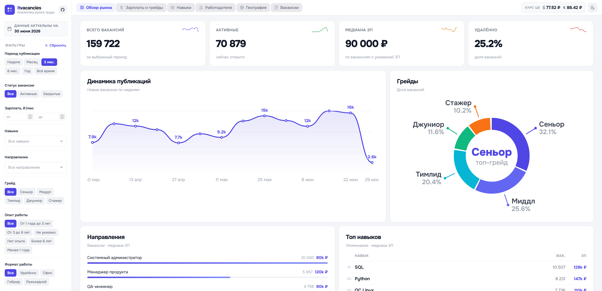
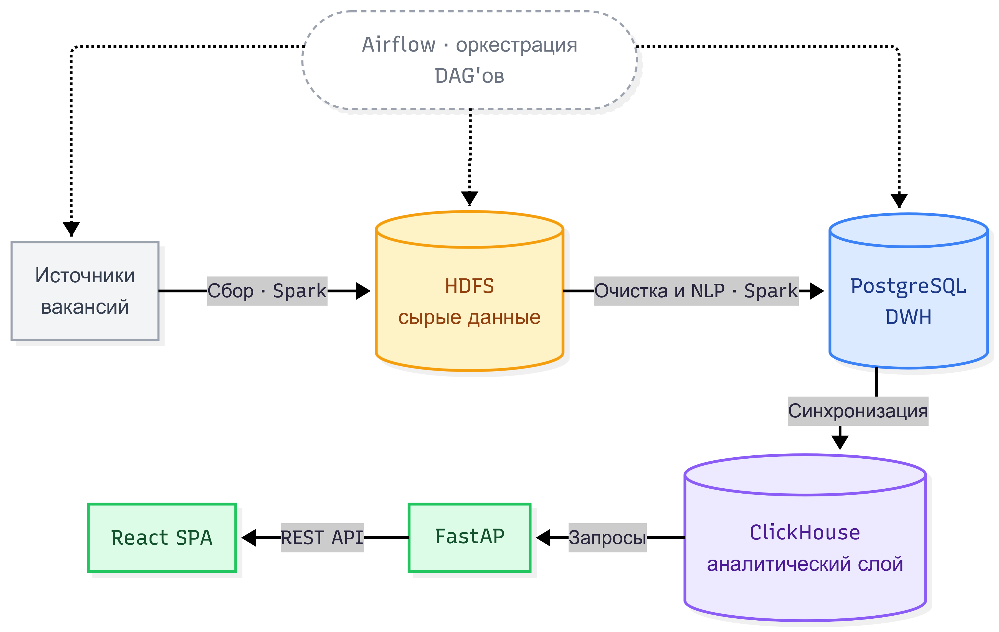
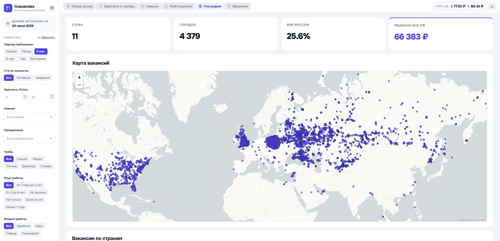
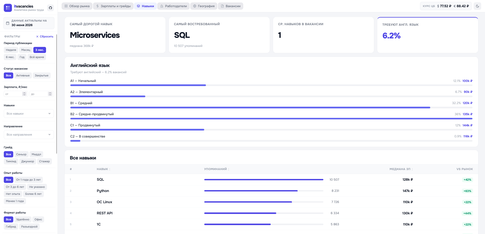
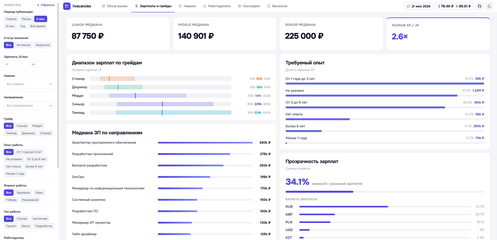

<div align="center">
  

  <h1>itvacancies</h1>
  <p><i>Аналитика рынка IT-вакансий России: зарплаты, навыки, грейды, работодатели и география</i></p>

  <a href="https://itvacancies.tech"></a>
  
  
  
  
  
  
  
</div>

<br>

<p align="center">
  <a href="https://itvacancies.tech">
    
  </a>
</p>

---

## О проекте

**itvacancies** ежедневно собирает вакансии с шести IT-площадок, приводит их к единому виду и показывает срез рынка труда в интерактивном дашборде: медианные зарплаты, востребованные навыки, грейды, работодатели и география.

<table>
<tr><td width="56"></td><td><a href="https://hh.ru"><b>hh.ru</b></a></td></tr>
<tr><td width="56"></td><td><a href="https://geekjob.ru"><b>GeekJob</b></a></td></tr>
<tr><td width="56"></td><td><a href="https://getmatch.ru"><b>GetMatch</b></a></td></tr>
<tr><td width="56"></td><td><a href="https://career.habr.com"><b>Habr Career</b></a></td></tr>
<tr><td width="56"></td><td><a href="https://finder.work"><b>Finder</b></a></td></tr>
<tr><td width="56"></td><td><a href="https://www.adzuna.com"><b>Adzuna</b></a></td></tr>
</table>

Каждая площадка описывает одну и ту же вакансию по-своему: разные названия должностей, грейдов, навыков и валют. Перед агрегацией данные проходят нечёткое сопоставление и нормализацию к общим справочникам, поэтому графики сравнивают сопоставимые величины, а не сырые строки с сайтов.

---

## Возможности

- **Обзор рынка** — динамика публикаций, медианные зарплаты, распределение по грейдам, доля удалённой работы
- **Зарплаты и грейды** — медианы по направлениям, опыту и грейдам — от стажёра до тимлида
- **Навыки** — самые востребованные технологии, частота упоминаний, медианные зарплаты по навыкам, требования к английскому
- **Работодатели** — кто активнее всего нанимает, число вакансий, медианные зарплаты и динамика найма по компаниям
- **География** — карта вакансий по городам и странам (WebGL-рендер, без потери точек на масштабе), доля удалёнки и зарплаты по регионам
- **Вакансии** — список актуальных вакансий с гибкими фильтрами по периоду, площадке, направлению, грейду и опыту

Данные обновляются ежедневно; фильтры в боковой панели применяются сквозно ко всем разделам.

---

## Архитектура

<p align="center">
  
</p>

Сбор вакансий разнесён по времени между площадками, чтобы не создавать пиковую нагрузку на источники и инфраструктуру. NLP-сервис (отдельный Flask-процесс с `sentence-transformers` + `rapidfuzz`) сопоставляет термины источников со справочниками вручную выверенных значений — через него же проходит ручная модерация спорных совпадений.

---

<details>
<summary><b>Ещё скриншоты</b></summary>
<br>

<table>
<tr>
  <td width="33%"></td>
  <td width="33%"></td>
  <td width="33%"></td>
</tr>
<tr>
  <td align="center">География</td>
  <td align="center">Навыки</td>
  <td align="center">Зарплаты и грейды</td>
</tr>
</table>

</details>

---

## Технологический стек

| Слой | Инструмент |
|---|---|
| Оркестрация | Apache Airflow 2.11.2 |
| ETL | Apache Spark 4.0.0 + Scala 2.13.16 |
| Сырое хранилище | Hadoop HDFS 3.3.5 |
| Хранилище данных (DWH) | PostgreSQL 17, миграции — Flyway 10 |
| Аналитический слой | ClickHouse 26.4.2 |
| NLP-нормализация | Python 3.11 + Flask + sentence-transformers + rapidfuzz |
| Backend API | FastAPI (Python 3.11) + clickhouse-connect |
| Frontend | React 18 + Vite 5 + TypeScript, карта — Leaflet + leaflet.glify (WebGL) |
| Reverse proxy (прод) | nginx 1.27 |
| Мониторинг | Grafana 11.6 + Prometheus 3.5 |
| Контейнеризация | Docker Compose |

---

## Быстрый старт (локально)

**Нужно:** Docker + Docker Compose, минимум **6 GB** свободной RAM.

```bash
# 1. Клонировать
git clone https://github.com/PiratikMr/itvacancies.git
cd itvacancies

# 2. Создать .env из примера (тестовые значения уже заполнены)
cp .env.example .env

# 3. Запустить
docker compose up -d
```

> **Данные появятся на следующий день** — Airflow запускает сбор по расписанию. Чтобы запустить сбор вручную, откройте Airflow UI и активируйте нужный DAG.

| Сервис | URL | Описание |
|---|---|---|
| Дашборд | http://localhost:5173 | React SPA — основной интерфейс |
| API | http://localhost:17000 | FastAPI, отдаёт данные для дашборда |
| NLP | http://localhost:15000 | Консоль нормализации справочников + matching API |
| Airflow | http://localhost:11080 | Управление DAG-пайплайнами, ручной запуск сбора |
| Grafana | http://localhost:16000 | Мониторинг инфраструктуры (Airflow, Spark, Postgres) |
| Spark Master | http://localhost:12080 | UI кластера Spark |
| HDFS NameNode | http://localhost:13870 | UI Hadoop — сырые данные в Parquet |
| Prometheus | http://localhost:15090 | Метрики всех сервисов |
| PostgreSQL | localhost:14432 | DWH |
| ClickHouse | localhost:18123 (HTTP) · localhost:19000 (TCP) | Аналитический слой, на котором работает API |

Логин/пароль по умолчанию: Airflow — `airflow` / `airflow`, Grafana — `admin` / `admin`.

---

## Конфигурация

Вся инфраструктурная конфигурация (хосты контейнеров, порты, логины/пароли баз данных, ключи Airflow и Grafana, домен) собрана в **едином `.env`-файле** в корне проекта:

```bash
cp .env.example .env
```

`.env.example` уже заполнен рабочими значениями для локального запуска — менять ничего не нужно.

### API-ключи площадок (`conf/secrets/`)

Ключи площадок и SMTP для уведомлений хранятся отдельно — в HOCON-файлах в `conf/secrets/`. Без них парсеры hh.ru и Adzuna не запустятся, остальные источники работают без авторизации.

```bash
# HeadHunter (OAuth-токен — https://dev.hh.ru/)
cp conf/secrets/local_hh.conf.example conf/secrets/local_hh.conf

# Adzuna (https://developer.adzuna.com/)
cp conf/secrets/local_az.conf.example conf/secrets/local_az.conf

# Курсы валют (https://exchangerate.host/, бесплатный план)
cp conf/secrets/local_exchangerate.conf.example conf/secrets/local_exchangerate.conf

# Email для Airflow-уведомлений о падениях DAG
cp conf/secrets/local_airflow.conf.example conf/secrets/local_airflow.conf
```

Внутри каждого `.example`-файла есть комментарии с объяснением что и зачем.

---

## Структура проекта

```
.
├── frontend/           # React SPA (Vite + TypeScript)
├── services/
│   ├── api/            # FastAPI — backend дашборда
│   ├── etl/            # Spark/Scala ETL (extract, transform, нормализация, load)
│   ├── nlp/            # Flask — fuzzy-matching и консоль нормализации справочников
│   └── orchestration/  # Airflow DAG'и
├── deploy/             # docker-compose-фрагменты и Dockerfile'ы по сервисам
├── db/                 # схема и миграции PostgreSQL/ClickHouse
└── conf/secrets/       # API-ключи и SMTP (вне репозитория, см. .example)
```

---

## Лицензия

Released under the [MIT License](LICENSE).
