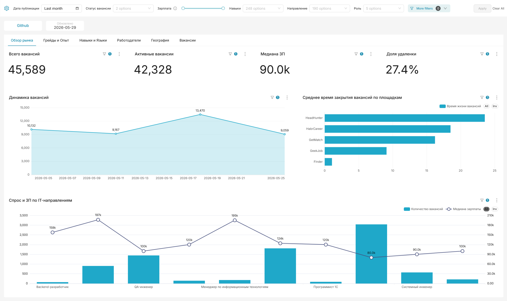

# itvacancies

Агрегатор IT-вакансий с автоматическим сбором, NLP-нормализацией и интерактивным дашбордом.

<p align="center">🌐 <strong>Live:</strong> <a href="https://itvacancies.tech">itvacancies.tech</a></p>

---

## Что это такое

**itvacancies** ежедневно собирает вакансии с шести IT-платформ:

<table>
<tr><td width="56"></td><td><a href="https://hh.ru"><b>hh.ru</b></a></td></tr>
<tr><td width="56"></td><td><a href="https://geekjob.ru"><b>GeekJob</b></a></td></tr>
<tr><td width="56"></td><td><a href="https://getmatch.ru"><b>GetMatch</b></a></td></tr>
<tr><td width="56"></td><td><a href="https://career.habr.com"><b>Habr Career</b></a></td></tr>
<tr><td width="56"></td><td><a href="https://finder.work"><b>Finder</b></a></td></tr>
<tr><td width="56"></td><td><a href="https://www.adzuna.com"><b>Adzuna</b></a></td></tr>
</table>

Данные со всех источников приводятся к единому виду через алгоритмы нечёткого поиска и языковую модель. Платформа предоставляет интерактивный дашборд для анализа IT-рынка труда: зарплаты, востребованные навыки, тренды по городам и грейдам.

---

## Скриншоты



---

## Быстрый старт

**Нужно:** Docker + Docker Compose, минимум **4–6 GB** свободной RAM.

```bash
# 1. Клонировать
git clone https://github.com/PiratikMr/itvacancies.git
cd itvacancies

# 2. Создать .env из примера (тестовые значения уже заполнены)
cp .env.example .env

# 3. Запустить
docker compose up -d
```

Первый запуск займёт 5–10 минут: загрузятся образы, инициализируются базы данных. Superset и NLP будут готовы раньше остальных.

> **Данные появятся на следующий день** — Airflow запускает сбор по расписанию. Чтобы запустить сбор вручную, откройте Airflow UI и активируйте нужный DAG.

---

## Основные сервисы

### Superset — аналитика

**http://localhost:16088** · логин: `admin` · пароль: `admin`

Интерактивные графики с зарплатами, навыками и трендами рынка IT-вакансий.

### NLP API — нормализация и семантический поиск

**http://localhost:15000**

Веб-интерфейс и HTTP API для поиска похожих навыков и должностей.

---

## Дополнительные сервисы

| Сервис | URL | Описание |
|---|---|---|
| Airflow | http://localhost:11080 | Управление DAG-пайплайнами, ручной запуск сбора |
| Grafana | http://localhost:16000 | Мониторинг инфраструктуры (Airflow, Spark, Postgres) |
| Spark Master | http://localhost:12080 | UI кластера Spark |
| HDFS NameNode | http://localhost:13870 | UI Hadoop — сырые данные в Parquet |
| Prometheus | http://localhost:15090 | Метрики всех сервисов |
| PostgreSQL | localhost:14432 | Основное хранилище данных (DWH) |
| ClickHouse | localhost:18123 (HTTP) · localhost:19000 (TCP) | Аналитический слой, на котором работает Superset |

Для Airflow и Grafana логин/пароль по умолчанию: `airflow` / `airflow` и `admin` / `admin` соответственно.

---

## Конфигурация

Вся инфраструктурная конфигурация (хосты контейнеров, порты, логины/пароли баз данных, ключи Airflow и Superset) собрана в **едином `.env`-файле** в корне проекта. Скопируйте пример и при необходимости отредактируйте значения:

```bash
cp .env.example .env
```

`.env.example` уже заполнен рабочими значениями — для локального запуска менять ничего не нужно.

### API-ключи площадок (`conf/secrets/`)

Ключи площадок и SMTP для уведомлений хранятся отдельно — в HOCON-файлах в `conf/secrets/`. Без них парсеры hh.ru и Adzuna не запустятся, остальные источники работают без авторизации.

```bash
# HeadHunter (OAuth-токен — https://dev.hh.ru/)
cp conf/secrets/local_hh.conf.example conf/secrets/local_hh.conf

# Adzuna (https://developer.adzuna.com/)
cp conf/secrets/local_az.conf.example conf/secrets/local_az.conf

# Курсы валют (https://exchangerate.host/, бесплатный план)
cp conf/secrets/local_exchangerate.conf.example conf/secrets/local_exchangerate.conf

# Email для Airflow-уведомлений о падениях DAG
cp conf/secrets/local_airflow.conf.example conf/secrets/local_airflow.conf
```

Внутри каждого `.example`-файла есть комментарии с объяснением что и зачем.

---

## Технологический стек

| Слой | Инструмент |
|---|---|
| Оркестрация | Apache Airflow 2.10 |
| ETL | Apache Spark 3.5 + Scala 2.12 |
| Сырое хранилище | Hadoop HDFS 3.3 |
| Хранилище данных (DWH) | PostgreSQL 17 |
| Аналитический слой | ClickHouse |
| NLP-матчер | Python 3.11 + Flask + sentence-transformers + rapidfuzz |
| Аналитика | Apache Superset (поверх ClickHouse) |
| Мониторинг | Grafana 11 + Prometheus |
| Контейнеризация | Docker Compose |

---

## Лицензия

Released under the [MIT License](LICENSE).
